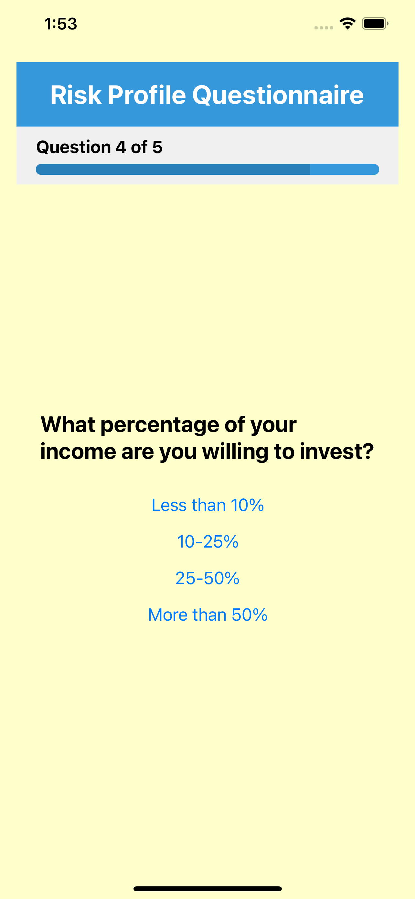
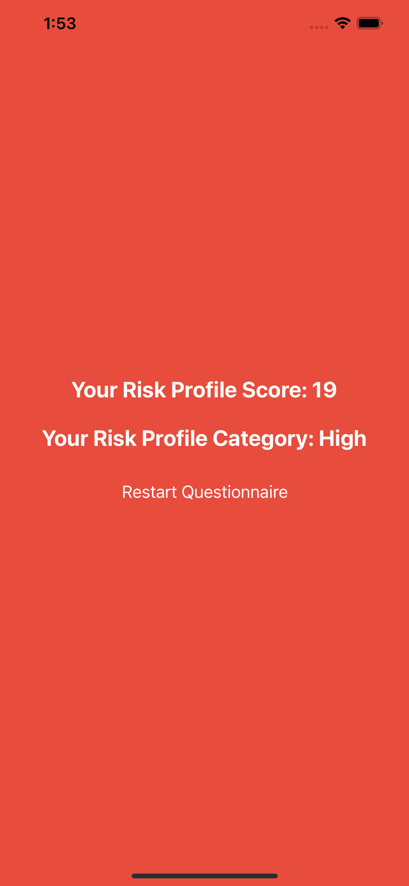

# Risk Profile App

The **Risk Profile App** is a mobile application built with React Native that helps users determine their risk profile based on a series of questions.

## Features

- **Home Screen**: Start the questionnaire.
- **Question Screen**: Answer multiple-choice questions.
- **Result Screen**: View your risk profile score and category.
- **Restart Questionnaire**: Start over from the beginning.

## Screenshots

   

## Required Versions

- **Node.js**: >= 18.0.0
- **React Native**: >= 0.74.0

## Installation

To run the project locally, follow these steps:

1. **Clone the repository:**

   ```bash
   git clone <repository-url>
   cd RiskProfileApp
# RiskProfile
